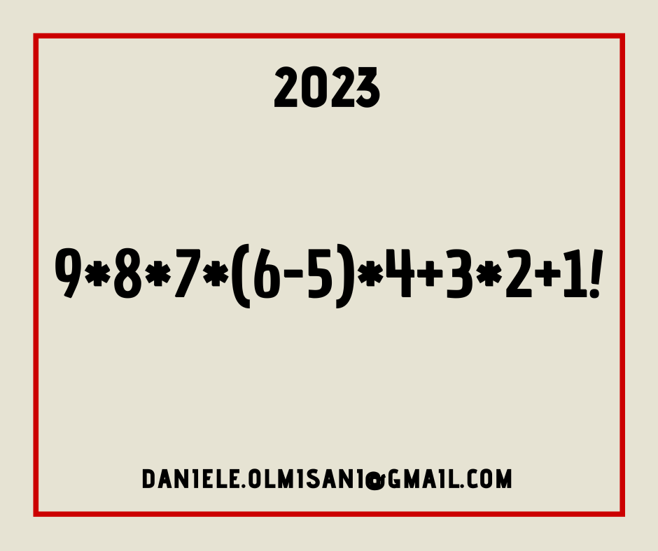
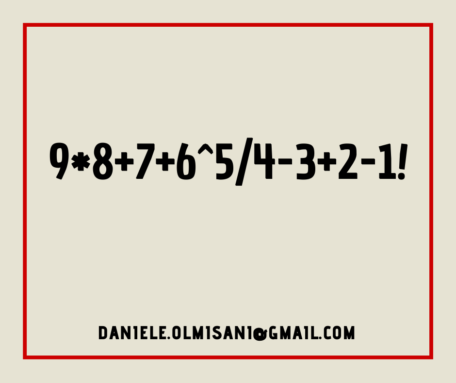
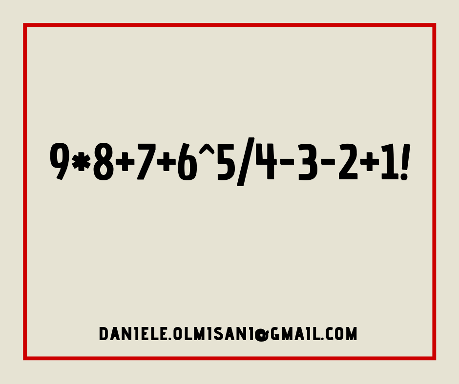

# newyearseve-formula

New Year's Eve countdown formula

## Usage

```code
newyearseve 0.1.0
looking for a New Year's Eve count down formula

USAGE:
    newyearseve-formula.exe [FLAGS] [OPTIONS] --target <target>

FLAGS:
    -h, --help       Prints help information
    -r, --report     output detailed results
    -V, --version    Prints version information

OPTIONS:
    -j, --jobs <jobs>        number of parallel jobs (0 will uses available cores) [default: 0]
    -t, --target <target>    target year
```

## Example

```code
newyearseve-formula.exe -t 2023

New Year's Eve countdown formula

target : 2023
jobs   : 12 on 12 cores
report : false

[00:01:03] ######################################## 100% (0s) done
[00:00:52] ######################################## 100% (0s) done
[00:00:56] ######################################## 100% (0s) done
[00:00:42] ######################################## 100% (0s) done
[00:00:46] ######################################## 100% (0s) done
[00:00:40] ######################################## 100% (0s) done
[00:00:44] ######################################## 100% (0s) done
[00:00:51] ######################################## 100% (0s) done
[00:01:01] ######################################## 100% (0s) done
[00:01:06] ######################################## 100% (0s) done
[00:00:59] ######################################## 100% (0s) done
[00:00:43] ######################################## 100% (0s) done

Results:
1 : 9*8+7+6^5/4+3-2-1
2 : 9*8+7+6^5/4-3+2+1

Found 547 solutions in 1 minute @8419 iter per millis
```

## Inspired Art

### 2025
```
9*8+7+6^5/4+3-2+1
```

### 2024
```
*8+7+6^5/4+3-2*1
```

### 2023


### 2021


### 2019

